```mermaid
flowchart TB
    subgraph Users["User Types"]
        H["Household User"]
        S["Shopkeeper"]
        A["Admin"]
    end

    subgraph Auth["Authentication Layer ✅"]
        Login["Login/Signup"]
        Gate["Admin Gate"]
        JWT["JWT Tokens"]
    end

    subgraph Frontend["Frontend (Next.js) ✅"]
        Dashboard["Dashboard"]
        Inventory["Inventory Mgmt"]
        Meal["Meal Planning 🚧"]
        Scan["Scanning 🚧"]
        Market["Marketplace 🚧"]
        Analytics["Analytics ✅"]
        AdminPanel["Admin Panel ✅"]
    end

    subgraph AdminFeatures["Admin Panel Pages"]
        AU["Users & Shops 🚧"]
        AI["Inventory Oversight 🚧"]
        AM["Marketplace Monitor 🚧"]
        AA["Analytics Dashboard 🚧"]
        AR["Rewards Mgmt 🚧"]
        AN["Notifications 🚧"]
        AS["System Settings 🚧"]
    end

    subgraph API["Backend API (Express.js)"]
        AuthAPI["Auth Endpoints ✅"]
        InventoryAPI["Inventory API 🚧"]
        UserAPI["User API 🚧"]
        MarketAPI["Marketplace API 🚧"]
        NotifAPI["Notification API 🚧"]
        AnalyticsAPI["Analytics API 🚧"]
    end

    subgraph ML["ML Service (FastAPI)"]
        Expiry["Expiry Prediction 🔄"]
        ImgClass["Image Classification 🔄"]
        Recipe["Recipe Suggestions 🔄"]
        OCR["OCR Receipt Scanning ❌"]
    end

    subgraph Database["Data Layer"]
        MongoDB["MongoDB"]
        Redis["Redis Cache"]
        RabbitMQ["RabbitMQ"]
    end

    subgraph External["External Services 🚧"]
        Email["Email (SMTP)"]
        SMS["SMS (Twilio)"]
        Push["Push Notifications"]
        Maps["Maps API"]
        Storage["Cloud Storage"]
    end

    subgraph Features["Core Features"]
        F1["Smart Inventory ✅"]
        F2["Expiry Alerts 🚧"]
        F3["Meal Planning 🚧"]
        F4["Marketplace 🚧"]
        F5["Gamification ❌"]
        F6["Analytics ✅"]
    end

    %% User flows
    H --> Login
    S --> Login
    A --> Login
    A --> Gate
    
    Login --> JWT
    Gate --> JWT
    JWT --> Frontend

    %% Frontend routing
    Frontend --> Dashboard
    Frontend --> Inventory
    Frontend --> Meal
    Frontend --> Scan
    Frontend --> Market
    Frontend --> Analytics
    
    A --> AdminPanel
    AdminPanel --> AU
    AdminPanel --> AI
    AdminPanel --> AM
    AdminPanel --> AA
    AdminPanel --> AR
    AdminPanel --> AN
    AdminPanel --> AS

    %% API connections
    Dashboard --> AuthAPI
    Inventory --> InventoryAPI
    Meal --> InventoryAPI
    Scan --> InventoryAPI
    Market --> MarketAPI
    Analytics --> AnalyticsAPI
    
    AdminPanel --> UserAPI
    AdminPanel --> AnalyticsAPI
    AdminPanel --> NotifAPI

    %% ML integrations
    Inventory --> Expiry
    Scan --> ImgClass
    Scan --> OCR
    Meal --> Recipe
    
    %% Database connections
    AuthAPI --> MongoDB
    InventoryAPI --> MongoDB
    UserAPI --> MongoDB
    MarketAPI --> MongoDB
    
    API --> Redis
    NotifAPI --> RabbitMQ
    
    %% External service connections
    NotifAPI --> Email
    NotifAPI --> SMS
    NotifAPI --> Push
    Market --> Maps
    Scan --> Storage
    
    %% Feature implementation
    Inventory --> F1
    ML --> F2
    Meal --> F3
    Market --> F4
    Dashboard --> F5
    Analytics --> F6

    classDef implemented fill:#90EE90,stroke:#2E8B57,stroke-width:2px
    classDef partial fill:#FFE4B5,stroke:#DAA520,stroke-width:2px
    classDef planned fill:#FFB6C1,stroke:#C71585,stroke-width:2px
    classDef simulated fill:#87CEEB,stroke:#4682B4,stroke-width:2px

    class Auth,Frontend,Dashboard,Inventory,Analytics,AdminPanel,AuthAPI,MongoDB,Redis,F1,F6 implemented
    class API,InventoryAPI,UserAPI,MarketAPI,NotifAPI,AnalyticsAPI,AU,AI,AM,AA,AR,AN,AS,Meal,Scan,Market,F2,F3,F4 partial
    class External,Email,SMS,Push,Maps,Storage,OCR,F5 planned
    class ML,Expiry,ImgClass,Recipe simulated

    %% Legend
    subgraph Legend
        L1["✅ Implemented"]
        L2["🚧 Partially Done"]
        L3["🔄 Simulated (Needs Real ML)"]
        L4["❌ Not Started"]
    end

    class L1 implemented
    class L2 partial
    class L3 simulated
    class L4 planned
```

**Legend:**
- ✅ **Implemented**: Fully working features
- 🚧 **Partially Done**: Structure exists, needs business logic
- 🔄 **Simulated**: Mock/rule-based, needs real ML models
- ❌ **Not Started**: Planned but not yet implemented
